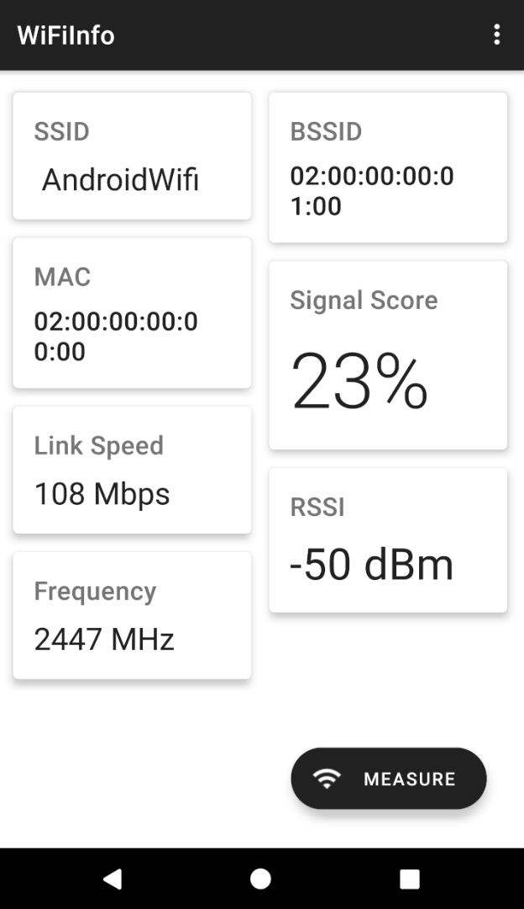

# WiFiInfo
Data Communication Project to measure **Wifi Signal Strength** using a mobile phone.

## PROPERTIES SHOWN
-   SSID: Name of the WiFi
-   MAC: Mac Address of the Device
-   LINK SPEED: Communication Link Speed
-   FREQUENCY: Communication Frequency
-   BSSID: Mac Address of the WiFi Router
-   SIGNAL SCORE: % Relative score depending upon the RSSI
-   RSSI: Signal Strength Measured in dBm

## MODES
As shown below, WiSS works 
-   INSTANTANEOUS -> Fetch and Show Mechanism
-   CONTINUOUS -> Continuous running loop keeps updating the latest  **RSSI**  &  **SCORE**  values.
-   BURST -> Get an average  **RSSI**  &  **SCORE**  value over an interval of 5000ms, Sampling-period 500ms.

